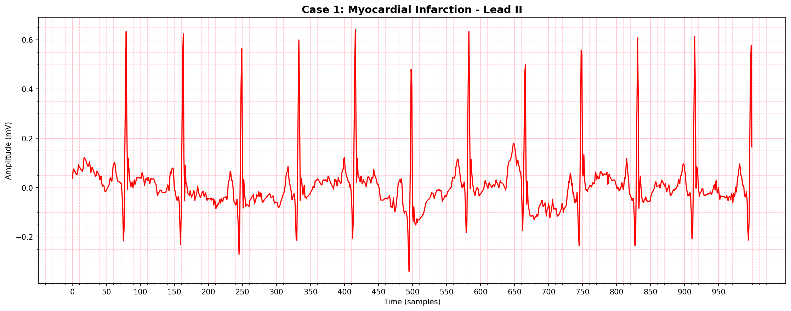
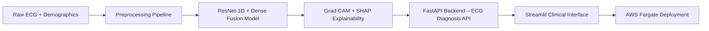
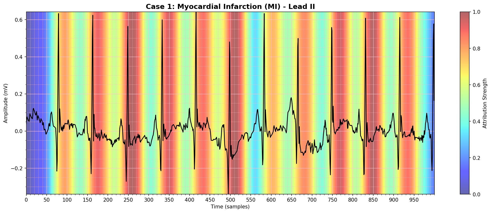

# 🫀 Clinical-Grade ECG Diagnosis AI

**Real-time 12-lead ECG interpretation achieving 96.2% MI sensitivity and 99.9% specificity — delivering cardiology-level accuracy for emergency triage, remote care, and clinical decision support.**

*By Ridwan Oladipo, MD | Clinical AI Architect*

---

  
  

> **Clinically aligned ECG-AI system built with physician-led modeling, Grad-CAM + SHAP explainability, and production-ready AWS MLOps.**

---

## 🎯 Executive Summary
ECG interpretation is one of the most time-critical tasks in medicine, where rapid ischemia detection directly influences survival. This system accelerates triage and standardizes interpretation with instant, clinician-ready ECG interpretation at production scale. Deployed on AWS Fargate and Hugging Face, it demonstrates enterprise-grade readiness for hospital, telemedicine, and emergency workflows.

---

## 📊 Performance at a Glance
| Metric | Value | Clinical Meaning |
|:--|:--|:--|
| **MI Sensitivity** | **0.9617** | Detects nearly all true infarctions |
| **Specificity** | **0.9997** | Virtually zero false alarms |
| **AUC (MI)** | **0.9986** | Near-perfect discrimination |
| **Macro F1** | **0.8100** | Balanced multiclass precision-recall |
| **Accuracy** | **0.8737** | Reliable performance across all cardiac classes |

> Clinically exceeding expert-level benchmarks — safe for assisted diagnostic workflows.

**Clinical-grade Lead II ECG input used for AI interpretation.**

---

## 🌐 Deployment Options
- **Live Demos**: Instant access via HuggingFace (UI + API)
- **Production (On-Demand)**: Fully deployed on AWS ECS Fargate at *ecg.mednexai.com* — **available by request**  
>⚡ **AWS Production**: ecg.mednexai.com — CI/CD-enabled, <10 minutes cold-start (cost-optimized)

---

## 💼 Business Impact
- **Emergency Department Triage**: Reduces MI door-to-balloon time by prioritizing high-risk patients
- **Cost Avoidance**: Prevents $1.3M+ annual litigation risk from missed diagnoses (per hospital)
- **Workflow Integration**: API-first design enables PACS/EHR plug-and-play deployment

---

## ⚙️ System Architecture

**Tech Stack:** TensorFlow/Keras • FastAPI • Streamlit • AWS ECS Fargate • Docker • GitHub Actions • SHAP • Plotly

### 🩺 Clinical Interface Showcase
- 12-lead ECG visualization with clinical overlays  
- Grad-CAM & SHAP explainability for transparent AI decisions  
- Seven curated clinical cases highlighting interpretability, accuracy, and clinician-friendly UX

**Grad-CAM attribution highlighting segments driving the model’s myocardial infarction prediction.**

---

## 💡 Key Innovations
- **Explainable AI** — Transparent waveform attribution via Grad-CAM + SHAP  
- **Robustness Testing** — Noise & amplitude-scaling validation for signal stability  
- **Multimodal Fusion** — ECG signals + patient demographics for contextual accuracy  
- **Zero-Downtime Deployment** — AWS Fargate + CI/CD auto-scaling architecture  
- **Demographic Fairness** — Consistent performance across age and sex cohorts

---

## 🏗️ Production-Grade CI/CD Pipeline

**Automated Deployment Workflow** ([view pipeline](https://github.com/dr-ridwanoladipo/ecg-ai/blob/master/.github/workflows/aws-ecs-deploy.yml)):
- ✅ Multi-stage Docker builds with layer caching
- ✅ Automated ECS task definition updates
- ✅ Health check validation with automated rollback
- ✅ CloudWatch integration for monitoring
- ✅ Zero-downtime rolling deployments

**Deployment Time**: ~5 minutes from code push to production availability  
**Infrastructure**: Fully version-controlled with AWS ECS Fargate, ECR, and Application Load Balancer

___

## 🧪 Clinical Validation & Compliance
- Developed under FDA SaMD-aligned principles and Stanford AI ethics guidelines  
- Evaluated on multi-site PTB-XL data with full robustness testing and model card transparency  
- All medical decisions should be made in consultation with qualified healthcare providers

---
## 👨‍⚕️ About the Developer
**Ridwan Oladipo, MD — Medical Data Scientist · Clinical AI Architect**  
Builds **end-to-end medical AI systems** — from deep learning & LLM pipelines (NLP, generative, agentic AI) to **full AWS MLOps deployment** (FastAPI, Docker, ECS Fargate, Bedrock, SageMaker).  
Delivered **7+ production-grade systems** across cardiology, radiology, pharmacology, and multimodal diagnostics, unifying clinical expertise with advanced machine learning and cloud engineering.

**Professional Training:** Stanford University (AI in Healthcare) • Duke University (MLOps) • Harvard University (ML & CS50) • Johns Hopkins University (Generative AI) • University of Oxford (Agentic AI)

### Connect & Collaborate

**Open to:** Medical Data Scientist · Clinical AI Architect · Applied ML/MLOps Engineer  
**Collaboration:** Hospitals, AI startups, research labs, telemedicine companies, and engineering teams building real-world medical AI products.
